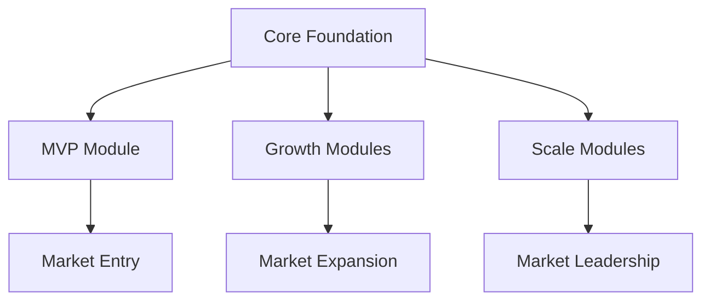

# Cognify Product Strategy v1.0
## From Vision to Victory: A Modular Journey to Educational Technology Leadership

**Document Owner:** Product Manager John
**Created:** September 26, 2025
**Version:** 1.0
**Status:** Strategic Foundation

---

## 🎯 Executive Summary

Cognify represents a **₹12,188 Crores ($1.46B) market opportunity** to become the first truly integrated, mobile-first educational platform powered by AI insights. Our strategy leverages a **modular architecture** with **MVP-first approach** to rapidly capture market share while building toward comprehensive platform leadership.

### Strategic Positioning Statement
*"The first unified educational ecosystem that seamlessly connects learning, operations, and relationships for Indian institutes with global ambitions."*

### Core Strategy Pillars
1. **MVP-First Launch** → Rapid market entry with core value
2. **Modular Expansion** → Systematic capability building
3. **India-First Design** → Cultural and operational differentiation
4. **AI-Powered Intelligence** → Competitive moats through automation
5. **Platform Evolution** → Long-term ecosystem thinking

---

## 📊 Market Intelligence & Opportunity

### Market Reality Check
- **Total Addressable Market:** ₹16,250 Crores with 25-30% CAGR
- **Primary Targets:** 125K tier-1/2 coaching institutes + 200K content creators
- **Critical Gap:** 90% want better analytics, only 20% satisfied with current solutions
- **Integration Pain:** 85% report challenges across existing tools

### Competitive Landscape Analysis
| Competitor | Strength | Critical Gap | Our Advantage |
|------------|----------|--------------|---------------|
| BYJU'S | Brand recognition | Limited B2B, expensive | Affordable B2B focus |
| Unacademy | Live learning | No ERP integration | Full institutional management |
| Teachmint | B2B understanding | Basic analytics | AI-powered insights |
| Graphy | Creator tools | Limited institutional features | Complete ecosystem |

### Blue Ocean Opportunity
**Integration + Mobile + AI + India-First = Market Leadership**

---

## 🏗️ Modular Architecture Strategy

### Design Philosophy: "Start Small, Scale Smart"
Our modular approach enables rapid MVP deployment while building toward comprehensive platform leadership. Each module operates independently but gains exponential value through integration.



### Module Classification Framework

#### **Tier 1: Foundation Modules (MVP - Months 1-6)**
**Goal:** Rapid market entry with immediate value delivery

1. **Core Learning Management System (LMS)**
   - Course creation and delivery
   - Student progress tracking
   - Basic assessment tools
   - Mobile-first experience

2. **Essential Student Management**
   - Student enrollment and profiles
   - Basic attendance tracking
   - Parent communication portal
   - Payment processing

3. **Communication Hub**
   - WhatsApp integration
   - SMS notifications
   - Email automation
   - Parent updates

**MVP Success Metrics:**
- Time to First Value: <14 days
- Customer Acquisition Cost: <₹25K (tier-2)
- Net Promoter Score: >4.0
- Monthly Active Users: 70%+ of enrolled students

#### **Tier 2: Growth Modules (Months 6-12)**
**Goal:** Competitive differentiation and market expansion

4. **Advanced ERP Features**
   - Financial management
   - Fee collection & reconciliation
   - Basic reporting dashboards
   - Multi-location management

5. **CRM & Lead Management**
   - Lead scoring and tracking
   - Sales pipeline management
   - Marketing automation
   - Referral management

6. **Analytics Engine**
   - Student performance insights
   - Institutional dashboards
   - Predictive analytics (basic)
   - Custom reporting

**Growth Success Metrics:**
- Net Revenue Retention: >120%
- Customer Satisfaction: >4.3/5.0
- Feature Adoption: 60%+ use 3+ modules
- Expansion Revenue: 30% of total revenue

#### **Tier 3: Scale Modules (Year 2+)**
**Goal:** Platform leadership and ecosystem expansion

7. **Community & Social Learning**
   - Student communities
   - Peer learning features
   - Discussion forums
   - Knowledge sharing

8. **Advanced AI Intelligence**
   - Personalized learning paths
   - Content recommendation engine
   - Automated course creation
   - Intelligent scheduling

9. **Marketplace & Partnerships**
   - Third-party integrations
   - Content marketplace
   - Partner ecosystem
   - API platform

**Scale Success Metrics:**
- Platform GMV: >₹100 Crores
- Ecosystem Partners: 100+ integrations
- International Expansion: 3+ countries
- Market Share: Top 3 in target segments

---

## 🚀 MVP Strategy: "Launch & Learn"

### MVP Core Value Proposition
**"Complete your digital transformation in 14 days with India's most intuitive educational platform."**

### MVP Feature Set (Months 1-6)
#### Module 1: Smart Learning Management
- **Course Builder:** Drag-and-drop course creation with templates
- **Multi-Format Content:** Video, PDF, text, quizzes support
- **Mobile PWA:** Offline-capable progressive web application
- **Regional Languages:** Hindi + English interface

#### Module 2: Essential Operations
- **Student Portal:** Enrollment, progress tracking, certificates
- **Parent App:** Real-time updates via WhatsApp integration
- **Payment Gateway:** Razorpay integration with installment support
- **Basic Analytics:** Attendance, progress, performance reports

#### Module 3: Communication Center
- **Automated Notifications:** WhatsApp, SMS, email triggers
- **Parent Updates:** Attendance, assignments, performance alerts
- **Announcement System:** Broadcast messages with targeting
- **Support Desk:** Basic help desk functionality

### MVP Go-To-Market Strategy

#### Phase 1: Tier-2 Coaching Centers (Months 1-3)
**Target:** 50 customers in focused geographies
- **Pricing:** ₹15K/month (Growth Plan)
- **Focus:** Uttar Pradesh, Rajasthan, Punjab coaching centers
- **Sales Cycle:** 30-45 days with demo-to-close approach

#### Phase 2: Validation & Iteration (Months 4-6)
**Target:** 100 customers with <5% churn
- **Focus:** Product-market fit optimization
- **Feature Enhancement:** Based on customer feedback
- **Expansion:** Additional states and institution types

### MVP Success Criteria
| Metric | Target | Measurement |
|--------|--------|-------------|
| Customer Acquisition | 100 customers | Monthly cohorts |
| Time to First Value | <14 days | Onboarding analytics |
| Customer Satisfaction | >4.0/5.0 | NPS surveys |
| Revenue Run Rate | ₹1.5 Cr/month | Financial tracking |
| Feature Adoption | >80% use core features | Product analytics |

---

## 📈 Growth Strategy: "Scale Through Integration"

### Growth Phase Roadmap (Months 6-12)

#### Advanced ERP Integration
**Value Proposition:** "One platform for all operations"
- GST compliance and Tally integration
- Advanced financial reporting
- Multi-location management
- Staff management and payroll

#### CRM & Marketing Automation
**Value Proposition:** "Turn leads into learners automatically"
- AI-powered lead scoring
- Automated nurture campaigns
- Social media integration
- Referral tracking and rewards

#### Analytics & Intelligence
**Value Proposition:** "Data-driven decisions for better outcomes"
- Predictive student success models
- Performance benchmarking
- Custom dashboard creation
- Automated insights and alerts

### Growth Success Framework
```
Customer Success → Feature Expansion → Market Expansion → Revenue Growth
```

---

## 🌏 India-First Differentiation Strategy

### Cultural & Operational Advantages

#### 1. Regional Language Excellence
- **15+ Languages:** Complete UI/UX in major Indian languages
- **Cultural Context:** Festival-aware scheduling, regional preferences
- **Local Support:** Regional language customer success teams

#### 2. India-Specific Integrations
- **GST Compliance:** Automatic tax calculation and filing
- **Tally Integration:** Seamless accounting software connectivity
- **Payment Gateways:** UPI, wallet, bank transfer support
- **WhatsApp Business:** Native integration for communication

#### 3. Offline-First Architecture
- **Smart Sync:** Work without internet, sync when available
- **Low Bandwidth:** Optimized for 2G/3G networks
- **Data Efficiency:** Minimal data consumption modes
- **Progressive Download:** Content caching strategies

#### 4. Educational Context Understanding
- **Traditional Coaching:** Support for classroom + digital hybrid
- **Parent Involvement:** Features designed for Indian parent engagement
- **Examination Focus:** Aligned with Indian educational patterns
- **Hierarchy Respect:** Role-based systems matching Indian institutional structures

---

## 🤖 AI & Intelligence Strategy

### AI-Powered Competitive Moats

#### Immediate AI Applications (MVP)
1. **Smart Content Organization:** Auto-categorize and tag content
2. **Basic Recommendations:** Suggest relevant materials to students
3. **Communication Intelligence:** Optimal timing for parent notifications
4. **Simple Analytics:** Automated insight generation from student data

#### Advanced AI Capabilities (Growth)
1. **Personalized Learning Paths:** Individual student journey optimization
2. **Predictive Analytics:** Early warning systems for student success
3. **Content Generation:** AI-assisted course creation and quiz generation
4. **Intelligent Scheduling:** Optimal class and resource allocation

#### Platform-Level AI (Scale)
1. **Institutional Intelligence:** Comparative performance benchmarking
2. **Market Insights:** Industry trends and opportunity identification
3. **Ecosystem Optimization:** Cross-platform integration intelligence
4. **Autonomous Operations:** Self-managing platform capabilities

### AI Development Roadmap
```
Rule-Based Automation → Machine Learning → Deep Learning → AI Platform
```

---

## 💰 Revenue Strategy & Monetization

### Pricing Architecture: "Value-Based Tiers"

#### MVP Pricing (Year 1)
| Plan | Price/Month | Target Segment | Key Features |
|------|-------------|----------------|--------------|
| **Starter** | ₹8K | Small coaching centers | Basic LMS, 100 students |
| **Growth** | ₹15K | Medium institutes | Full LMS + ERP, 500 students |
| **Pro** | ₹25K | Large institutes | All features, 1000 students |
| **Enterprise** | Custom | Multi-location | Unlimited + customization |

#### Revenue Streams Evolution
```
Year 1: SaaS Subscriptions (100%)
Year 2: SaaS (70%) + Marketplace (20%) + Services (10%)
Year 3: SaaS (60%) + Marketplace (25%) + Services (10%) + Platform (5%)
```

### Financial Projections
| Year | Customers | ARR | Revenue |
|------|-----------|-----|---------|
| Year 1 | 150 | ₹1.8L avg | ₹17 Cr |
| Year 2 | 500 | ₹2.5L avg | ₹75 Cr |
| Year 3 | 1000 | ₹3.2L avg | ₹200 Cr |

---

## 🎯 Customer Success Strategy

### Customer-Centric Success Framework

#### Onboarding Excellence
1. **14-Day Success Plan:** Guaranteed value delivery within 2 weeks
2. **Dedicated Success Manager:** Personal guidance for first 90 days
3. **Training Program:** Comprehensive platform education for staff
4. **Migration Support:** Data import and system transition assistance

#### Ongoing Success Management
1. **Health Score Monitoring:** Proactive identification of at-risk accounts
2. **Regular Business Reviews:** Quarterly success assessments
3. **Feature Adoption Tracking:** Guided expansion of platform usage
4. **Community Building:** Customer success network and best practices

#### Success Metrics & KPIs
- **Time to First Value:** <14 days (MVP requirement)
- **Feature Adoption:** >60% use 3+ modules within 6 months
- **Customer Health Score:** >80% maintain "green" status
- **Net Promoter Score:** >4.5/5.0 by month 12
- **Expansion Revenue:** 30% of total revenue from existing customers

---

## 🔄 Implementation Roadmap

### Phase-Gate Approach with Clear Milestones

#### Phase 1: Foundation (Months 1-6)
**Milestone Gates:**
- Month 2: MVP core features complete
- Month 4: First 25 paying customers
- Month 6: 100 customers, <5% churn

**Key Activities:**
- MVP development and testing
- Pilot customer acquisition
- Product-market fit validation
- Team scaling and process establishment

#### Phase 2: Growth (Months 6-12)
**Milestone Gates:**
- Month 8: Advanced ERP modules live
- Month 10: CRM integration complete
- Month 12: 500 customers, analytics platform

**Key Activities:**
- Module expansion development
- Market expansion into tier-1 institutes
- Sales team scaling
- Customer success program optimization

#### Phase 3: Scale (Year 2)
**Milestone Gates:**
- Q1: Community platform launch
- Q2: AI intelligence features
- Q3: Marketplace MVP
- Q4: International expansion pilot

**Key Activities:**
- Platform capabilities development
- Ecosystem partner onboarding
- International market entry
- Advanced AI/ML implementation

---

## ⚠️ Risk Management & Mitigation

### Strategic Risk Assessment

#### High-Priority Risks
1. **Product-Market Fit Failure**
   - *Mitigation:* Rapid iteration cycles, customer co-creation
   - *Contingency:* Pivot capability within 90 days

2. **Competitive Response**
   - *Mitigation:* Strong differentiation, rapid feature development
   - *Contingency:* Enhanced pricing flexibility, partnership acceleration

3. **Technology Scalability**
   - *Mitigation:* Cloud-native architecture, performance monitoring
   - *Contingency:* Infrastructure partnership strategy

4. **Market Timing**
   - *Mitigation:* MVP approach, market validation gates
   - *Contingency:* Geographic expansion acceleration

#### Medium-Priority Risks
- Talent acquisition challenges
- Regulatory changes in EdTech
- Economic downturn impact
- Customer concentration risk

---

## 📊 Success Metrics & KPIs

### Strategic Dashboard Framework

#### Business Metrics (Monthly)
- **Revenue Growth:** Month-over-month and year-over-year
- **Customer Acquisition Cost:** By segment and channel
- **Lifetime Value:** Cohort-based analysis
- **Net Revenue Retention:** Expansion vs. churn

#### Product Metrics (Weekly)
- **Feature Adoption:** Module usage across customer base
- **User Engagement:** Daily/monthly active users
- **Performance:** Platform uptime and response times
- **Support:** Ticket volume and resolution times

#### Market Metrics (Quarterly)
- **Market Share:** In target segments and geographies
- **Brand Awareness:** Aided and unaided recognition
- **Customer Satisfaction:** NPS and CSAT scores
- **Competitive Position:** Feature and pricing comparisons

---

## 🌟 Vision 2027: Platform Leadership

### Long-Term Strategic Vision
By 2027, Cognify will be the dominant educational technology platform in India, serving over 10,000 institutions and 5 million learners, with expanding international presence and a thriving ecosystem of partners.

### Platform Evolution Trajectory
```
2025: Integrated SaaS Platform
2026: AI-Powered Ecosystem
2027: Global Education Network
```

### Success Indicators
- **Market Position:** Top 3 in Indian EdTech B2B market
- **Financial Performance:** ₹500+ Cr revenue, profitable growth
- **Global Expansion:** 5+ countries, localized offerings
- **Innovation Leadership:** 50+ AI-powered features, patent portfolio

---

## 🎯 Immediate Next Steps (30-60-90 Days)

### 30-Day Sprint
1. **Team Assembly:** Complete core product and engineering teams
2. **MVP Specifications:** Detailed feature requirements and user stories
3. **Technology Architecture:** Finalize tech stack and infrastructure decisions
4. **Design System:** Core UI/UX principles and component library

### 60-Day Milestone
1. **MVP Development:** Core features in alpha testing
2. **Pilot Customers:** 5-10 beta customers identified and onboarded
3. **Go-to-Market:** Sales process, pricing, and marketing materials
4. **Operations Setup:** Customer success, support, and billing systems

### 90-Day Goals
1. **MVP Launch:** Public availability with core feature set
2. **Customer Traction:** 25 paying customers with positive feedback
3. **Product Iteration:** First major update based on customer insights
4. **Scale Preparation:** Team, systems, and processes for growth phase

---

## 📋 Conclusion

Cognify's product strategy balances ambitious vision with practical execution through our modular, MVP-first approach. By focusing on rapid value delivery while building comprehensive platform capabilities, we can capture significant market share in the underserved Indian EdTech B2B segment.

Our success depends on:
- **Relentless customer focus** with rapid value delivery
- **Systematic capability building** through modular architecture
- **India-first differentiation** with global scalability
- **Data-driven decision making** at every stage
- **Team execution excellence** across all functions

**The opportunity is massive. The timing is perfect. The strategy is sound.**

*Let's build the future of education in India and beyond.*

---

**Document Control:**
- **Next Review:** October 26, 2025
- **Stakeholder Approval:** Required from CEO, CTO, Head of Sales
- **Distribution:** Leadership team, Board of Directors
- **Confidentiality:** Internal Strategic Document - Do Not Share Externally